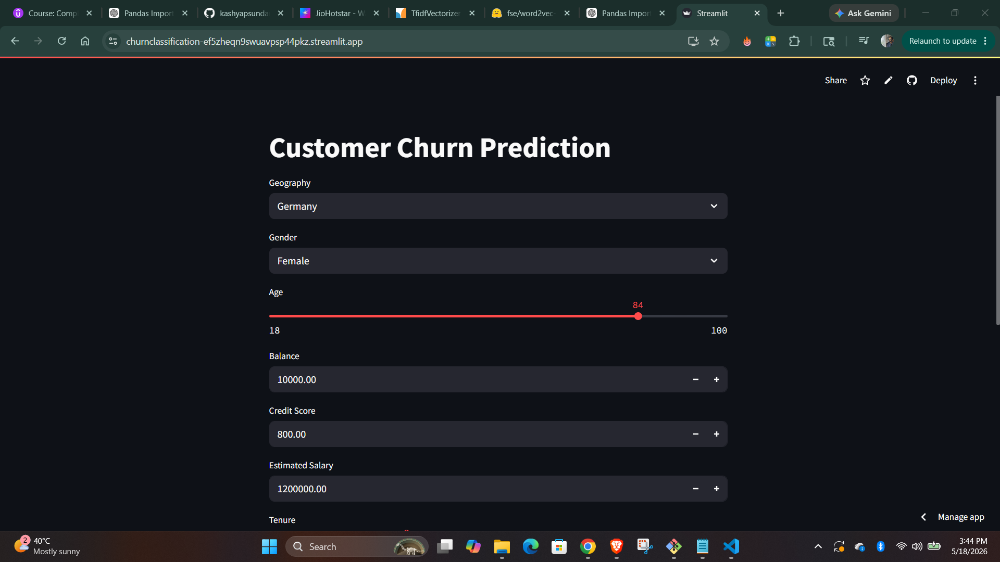
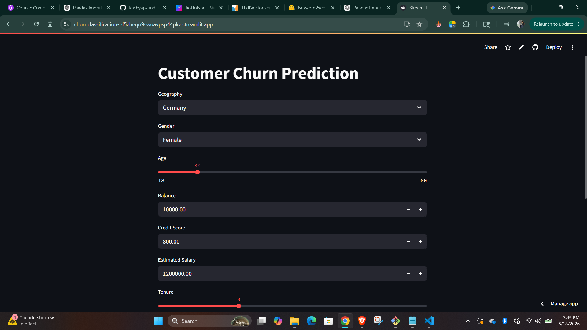
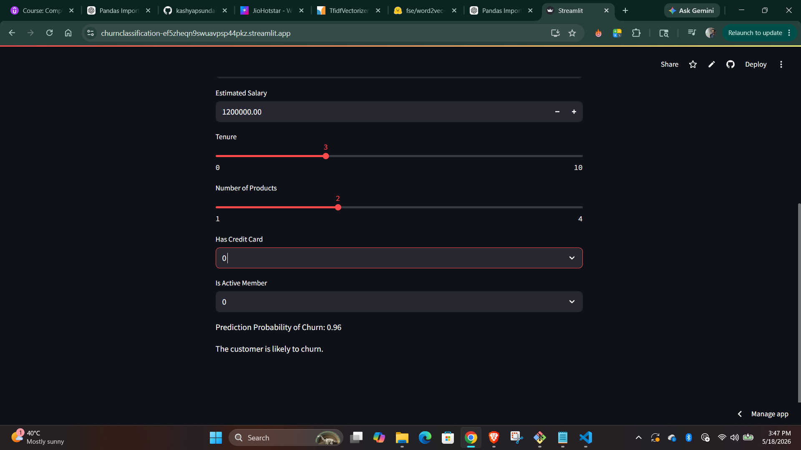
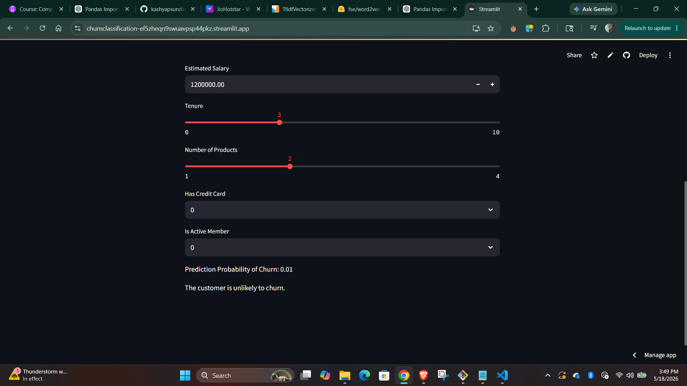

# Customer Churn Prediction using ANN

This project predicts customer churn using an Artificial Neural Network (ANN) built with TensorFlow/Keras and deployed using Streamlit.

## Features
- Data preprocessing and feature engineering
- Label Encoding and One-Hot Encoding
- Feature scaling using StandardScaler
- ANN model training using TensorFlow/Keras
- Real-time prediction using Streamlit
- Customer churn probability prediction

## Technologies Used
- Python
- TensorFlow / Keras
- Pandas
- NumPy
- Scikit-learn
- Streamlit

## Input Features
- Credit Score
- Geography
- Gender
- Age
- Tenure
- Balance
- Number of Products
- Has Credit Card
- Is Active Member
- Estimated Salary

## Run the Project

Install dependencies:

```bash
pip install -r requirements.txt
```

Run Streamlit app:

```bash
streamlit run app2.py
```

## Project Structure

```text
ANN_Project/
│
├── app2.py
├── experiment.ipynb
├── prediction.ipynb
├── model.keras
├── scaler.pkl
├── geo_oh_encoder.pkl
├── label_encoder_Gender.pkl
├── Churn_Modelling.csv
├── requirements.txt
└── README.md
```

## Output
The model predicts whether a customer is likely to churn based on customer information.

## App Screenshots

### Input



### Output

